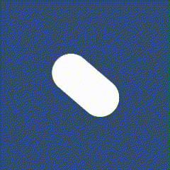

# CallBack Method
Start(), Update()

---
# transform.Rotate()

```csharp
void Update()
{
    gameObject.transform.Rotate(0f, 0f, 45f * Time.deltaTime);
}
```

---
# transform.Translate()

```csharp
void Update()
{
    gameObject.transform.Translate(new Vector3(0, 1 * Time.deltaTime, 0));
}
```
## Rotate + Translate

```csharp
void Update()
{
	gameObject.transform.Rotate(0f, 0f, 45f * Time.deltaTime);
	gameObject.transform.Translate(new Vector3(0, 1 * Time.deltaTime, 0));
}
```

---
# SerializeField
Inspector 창에서 변수에 접근할 수 있게된다.
```csharp
[SerializeField] float steerSpeed = 45f;
```
코드에서 값을 설정하더라도 Inspector 창에서 값을 수정하면 해당 값이 새로운 값으로 적용된다.

---
# Input.GetAxis()
플레이어의 물리적인 동작을 변환하는 방법
**Old System 방식**과 New System 방식이 존재한다.
```
eidt -> Project Settings -> Input Manager -> Axes 
(※ Axes 는 Axis 의 복수형)
```
`Horizontal`, `Vertical` 값은 -1(left) ~ +1(right)  범위의 값을 가진다.
</br>

```csharp
float steerAmount = Input.GetAxis("Horizontal");
float moveAmount = Input.GetAxis("Vertical");
gameObject.transform.Rotate(0f, 0f, steerSpeed * Time.deltaTime * -steerAmount);
gameObject.transform.Translate(new Vector3(0, moveSpeed * Time.deltaTime * moveAmount, 0));

```

---
# Time.deltaTime

각 프레임에 소요된 시간에 어떠한 값을 곱하면 프레임률에 독립성(`frame rate independent`) 을 가진 값을 구할 수 있다.
프레임률에 독립성을 가졌다는 의미는 어떠한 기기에서든 동일한 동작을 함을 의미한다.
```
A : 10FPS 의 성능을 가진 컴퓨터
B : 100FPS 의 성능을 가진 컴퓨터

매 프레임에 1cm 이동하게 하면...
A는 같은 시간동안 10cm 이동, B는 100cm 이동한다.
컴퓨터의 성능이 각 플레이어의 능력치에 영향을 주면안된다.
이를 위해 아래와 같은 연산을 수행하게된다.

A -> 1 x 10 x 0.1 = 1cm
B -> 1 x 100 x 0.01 = 1cm
위 연산에서 각 컴퓨터의 값을 보정해주는 10 과 100의 역할을 DeltaTime이 수행한다.
```

---
# 충돌
Unity 의 2D 환경에서 충돌을 구현할 때 사용하는 주요 컴포넌트로는 Collider2D 와 Rigidbody2D 가 있다.
Collider 만 추가하면 충돌 감지만 가능하고, 물리적인 반응은 없다. 때문에 충돌시 반응이 있길 원한다면 RigidBody 도 함께 추가해야한다.

##  Collider 2D
객체의 경계를 정의하여 다른 객체와의 충돌을 감지 할 수 있도록 하는 컴포넌트다.
물리적인 반응은 없고, 충돌을 감지하는 용도로만 사용한다.
2D 접미사가 붙어있지 않은 컴포넌트들은 3D를 위한 컴포넌트다.
</br>

Collider 를 추가하면 Game View 에서는 보이지 않는 외곽선이 추가된다.
</br>

`isTrigger` 옵션을 활성화하면 충돌을 감지할 수 있지만, 실제 충돌 효과는 없다.
## RigidBody 2D
물리 연산을 적용할 수 있도록 객체에 물리적인 속성을 추가하는 컴포넌트다.
중력, 관성, 힘 등의 영향을 받아 움직이고 회전할 수 있다.
</br>

rigid body 컴포넌트를 추가한 뒤부턴 충돌시 튕겨나오게된다.
↓ Capsule 에 RigidBody 추가
</br>

충돌되는 객체에도 rigid body 컴포넌트를 추가해주면 상호작용을 할 수 있다.
↓ Capsule 과 Circle 에 RigidBody 추가
</br>

## OnCollisionEnter2D(Collision2D)
물리적인 충돌이 발생했을 때 호출됨
두 객체가 모두 Collider2D 를 포함하고 둘 중 하나 이상이 RigidBody2D 를 포함해야함
실제 충돌 효과가 있다. (객체가 반동하거나 멈춤)
isTrigger = false
```csharp
void OnCollisionEnter2D(Collision2D collision)
{
    Debug.Log("충돌 발생! 상대 객체: " + collision.gameObject.name);
}
```

## OnTriggerEnter2D(Collider2D)
`isTrigger` 옵션이 활성화된 Collider2D에서 호출됨
물리적인 충돌 효과 없음 (통과, 겹침 가능)
충돌 판별 후, 이벤트 처리용으로만 사용하고 싶은경우 사용
isTrigger = true
```csharp
void OnTriggerEnter2D(Collider2D other)
{
    Debug.Log("트리거 감지! 상대 객체: " + other.gameObject.name);
}
```

---
# Sprites
스프라이트는 픽셀(pixel)로 이루어져 있다.
1 유니티 단위 = 100px
이미지의 크기를 크게 하고 싶으면 단위 당 픽셀을 줄여주면된다.
</br>


---
# Camera Follow
```csharp
[SerializeField] GameObject thigToFollow;

// This thigs position (camera) should be the same as the car's position.
void LateUpdate()
{
    transform.position = 
	    thigToFollow.transform.position + new Vector3(0, 0, -10);
}
```

---
