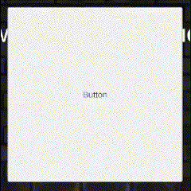

<< 강의 설명이 체계적이지 않아 중도 포기 >>
# UI Canvas
UI = User Interface</br>
Text, Button, Slider, Menu, etc 을 포함한다.</br>
`우클릭 -> UI -> Canvas` 를 통해 생성할 수 있으며, 생성시 EventSystem 도 함께 생성된다.</br>
</br>
UI 요소의 Inspector 를 확인해보면, 일반 객체와 달리 **Standard Transform Component** 대신 **Rect Transform** 이 있다.</br>
</br>

---
# TextMeshPro
`Window ->Package Manager -> TextMeshPro`를 통해 추가해준다.</br>
Font 변경을 하기위해선 Font Asset 이 필요하다.</br>
`Window -> TextMeshPro -> Font Asset Creator` </br>
</br>
설정할게 많아보이지만 SourceFont만 신경써주면 된다.</br>
SourceFont 를 설정하고 Generate Font Atlas 버튼을 클릭하면 Font Asset 이 생성된다.</br>
생성된 Font Asset 으로 변경해주면 Font 가 적용된다.</br>
</br>
TextMeshPro의 색상 변경 옵션에서 Color Gradient 옵션을 활성화하면 추가 설정이 활성화된다.</br>
</br>

---
# Button-TextMeshPro
`우클릭 -> UI -> Button-TextMeshPro` 를 선택하여 버튼을 생성할 수 있다.</br>
Button 의 Inspector 창에서 Interactable 옵션은 버튼의 활성화 여부를 결정하며 기본값은 true이다. 이를 false 로 만들면 동작은 회색으로 변하며 비활성화된다.</br>
아래는 버튼의 Inspector 창으로 각 동작에 해당하는 색상을 변경할 수 있는데 순서대로 기본, Hovering, OnClick, Clicked, Disable 에 해당한다.</br>
</br>
</br>
Button 의 Image Type 을 Simple -> Sliced 로 변경한다.</br>
그럼 아래와 같이 `This image doesn't have a border.` 를 경고창이 등장하는데, 이미지에 테두리를 만들어 주도록 한다.</br>
</br>
버튼에 사용할 이미지를 선택하고 Inspector 창에서 Open Sprite Editor 버튼을 통해 에디터 창을 연다. 이후, Border 를 설정해준다.</br>
</br>

---
# Layout Group
Create Empty 를 통해 비어있는 오브젝트 객체를 생성하고, **Vertical Layout Group** 을 추가해준다.</br>
</br>
해당 컴포넌트가 추가된 Obejct 의 자식 오브젝트로 버튼을 추가하고 설정을 수정하여 정렬한다.</br>
</br>

---
# ScriptableObject

ScriptableObject 를 활용하기 위해선 아래와 같은 형태로 생성한 클래스가 ScriptableObject 를 상속해야한다.</br>
```csharp
[CreateAssetMenu]
public class QuestionSO : ScriptableObject
```
`[CreateAssetMenu]`키워드를 추가해주면 `우클릭 -> Create`에서 해당 클래스를 발견할 수 있다.</br>
</br>
메뉴창에 나타나는 ScriptableObject 의 이름은 아래와 같은 방법으로 수정할 수 있다.</br>
```csharp
[CreateAssetMenu(menuName = "Quiz Question", fileName = "New Question")]
public class QuestionSO : ScriptableObject
```
</br>
ScriptableObject 클래스에 파라미터를 추가하면 생성된 객체에서 해당 값을 확인할 수 있다.</br>
string 의 경우 길이가 길어지면 수정이 힘들 수 있기에 `[TextAreat(a,b)]` 키워드를 통해 Inspector 창에서 보이는 UI의 모습을 변형할 수 있다.</br>
</br>

---
# Getter Method
해당 메서드를 활용하여 클래스 내의 Private 변수를 보호할 수 있다.</br>
```csharp
[TextArea(2,6)] // TextArea(a,b) -> a : minLinesCnt, b : maxLineCnt
[SerializeField] string question = "Enter new question text here.";

public string GetQuestion()
{
	return question;
}
```

---
# Array
index 가 0부터 시작한다.</br>
```csharp
// case1)
int[] oddNumbers = {1,3,5,7,9};

// case2)
int[] oddNumbers = new int[5];
```


---
# TextMeshProUGUI
이를 사용하기 위해선 TMPro 를 추가해줘야한다.</br>
```csharp
using TMPro;
```
- TextMeshPro : 게임 세계에 실제로 존재하는 텍스트를 위한 것
- TextMeshProUGUI : UI 기반 텍스트를 위한 것

---
# GetComponentInChildren\<T>
자식 항목 중 첫 번짼 T 컴포넌트를 찾아 반환한다.

---
# Button-Interactable option
해당 옵션을 비활성화하면 버튼이 더이상 클릭되지 않는다.</br>
</br>

---
# Image-Image Type option

</br>


---
# List\<T>
```csharp
List<T> list = new List<T>();
```
- List.Count
- List.Contains(n);
- List.Add(n);
- List.Remove(n);
- List.RemoveAt(idx);
- List.Clear();

---


